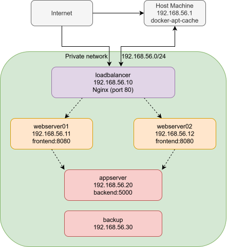

# Automation Alchemy

A containerized infrastructure monitoring application deployed across a multi-server virtual environment, fully automated with Vagrant. A diagnostic frontend displays live system metrics served by a backend API, distributed across two web servers behind a load balancer. A GitHub Actions CI/CD pipeline automatically tests, builds, and publishes updated images, which are picked up and deployed by Watchtower running on each server.

---

## Architecture



| VM           | IP            | Role                                              |
|--------------|---------------|---------------------------------------------------|
| loadbalancer | 192.168.56.10 | Nginx reverse proxy, distributes traffic          |
| webserver01  | 192.168.56.11 | Frontend container, serves UI and proxies metrics |
| webserver02  | 192.168.56.12 | Frontend container, serves UI and proxies metrics |
| appserver    | 192.168.56.20 | Backend container, exposes `/metrics` API         |
| backup       | 192.168.56.30 | Automated weekly backups via rsync                |

---

## Objectives

- Fully automate infrastructure provisioning with Vagrant and shell scripts
- Deploy a containerized application across a multi-server infrastructure
- Configure a load balancer to distribute traffic between two web servers
- Implement a CI/CD pipeline that detects code changes, builds images, and deploys updates automatically
- Secure all servers with firewall rules, SSH hardening, and Fail2Ban
- Automate weekly backups of application data, `/home`, and `/etc`

---

- [Architecture](#architecture)
- [Objectives](#objectives)
- [System Requirements](#system-requirements)
- [Prerequisites](#prerequisites)
- [Configuration](#configuration)
  - [Apt Cache (Optional)](#apt-cache-optional)
- [Setup and Installation](#setup-and-installation)
- [Accessing the Application](#accessing-the-application)
- [Quick SSH Access](#quick-ssh-access)
- [Verifying the Infrastructure](#verifying-the-infrastructure)
  - [Server communication](#server-communication)
  - [Containerization tools](#containerization-tools)
  - [Firewall rules](#firewall-rules)
  - [Load balancer configuration](#load-balancer-configuration)
- [Application](#application)
  - [Backend](#backend)
  - [Frontend](#frontend)
  - [Containerization](#containerization)
- [CI/CD Pipeline](#cicd-pipeline)
  - [GitHub Actions](#github-actions)
  - [Watchtower](#watchtower)
  - [Rollback](#rollback)
- [Load Balancing](#load-balancing)
- [Backup](#backup)
  - [What is backed up](#what-is-backed-up)
  - [Schedule](#schedule)
  - [Running a manual backup](#running-a-manual-backup)
  - [Restoring from backup](#restoring-from-backup)
- [Security](#security)
- [Bonus Features](#bonus-features)
- [Author](#author)

---

## System Requirements

- At least 16GB RAM (each VM uses between 1-2GB)
- At least 20GB free disk space

## Prerequisites

Before running `vagrant up`, make sure you have the following installed and configured on your host machine:

- [Vagrant](https://www.vagrantup.com/)
- [VirtualBox](https://www.virtualbox.org/)
- [Docker Desktop](https://www.docker.com/products/docker-desktop/) (optional, for apt cache)

Generate the required SSH keys:

```bash
ssh-keygen -t ed25519 -f ~/.ssh/devops_key -N ""
ssh-keygen -t ed25519 -f ~/.ssh/backup_key -N ""
```

Copy `.env.example` to `.env` and fill in the required values:

```bash
cp .env.example .env
```

---

## Configuration

`.env` reference:

| Variable          | Required | Description                                            |
|-------------------|----------|--------------------------------------------------------|
| `DEVOPS_PASSWORD` | Yes      | Password for the devops user on all VMs                |
| `APT_CACHE_URL`   | No       | URL of an apt-cacher-ng proxy to speed up provisioning |

### Apt Cache (Optional)

Provisioning requires downloading packages on every VM. Without a cache each VM downloads the same packages independently, which is slow. An apt-cacher-ng proxy caches packages on the first download and serves them locally for all subsequent requests, significantly speeding up provisioning especially when rebuilding VMs frequently.

If `APT_CACHE_URL` is not set in `.env` provisioning works normally, just without the cache benefit.

To use the optional apt cache, start the container on your host machine first:

```bash
docker run -d \
    --name apt-cache \
    --restart unless-stopped \
    -p 3142:3142 \
    -v apt-cache-data:/var/cache/apt-cacher-ng \
    sameersbn/apt-cacher-ng
```

Then set in `.env`:

```
APT_CACHE_URL=http://192.168.56.1:3142
```

---

## Setup and Installation

```bash
vagrant up
```

Vagrant will provision all five VMs in order. The full setup takes around 10-15 minutes depending on your internet connection.

To provision a single VM:

```bash
vagrant up loadbalancer
```

To reprovision without recreating VMs:

```bash
vagrant provision
```

To destroy all VMs:

```bash
vagrant destroy -f
```

---

## Accessing the Application

Once provisioned, open your browser and navigate to:

```
http://192.168.56.10
```

The load balancer distributes requests between webserver01 and webserver02. Refreshing the page will alternate the "Served by" hostname between the two web servers, confirming the load balancer is working.

To fetch raw metrics from the load balancer:

```bash
curl http://192.168.56.10/metrics
```

---

## Quick SSH Access

A Windows Terminal helper script is included that opens SSH sessions to all five VMs in a single split-pane window.

Run it from the project root:

```bat
.\terminal.cmd
```

This opens five panes simultaneously, one per VM, using the devops key for authentication. Requires Windows Terminal to be installed.

To SSH into a single VM manually:

```bash
ssh -i ~/.ssh/devops_key devops@192.168.56.10
```

| VM           | IP            |
|--------------|---------------|
| loadbalancer | 192.168.56.10 |
| webserver01  | 192.168.56.11 |
| webserver02  | 192.168.56.12 |
| appserver    | 192.168.56.20 |
| backup       | 192.168.56.30 |

---

## Verifying the Infrastructure

### Server communication

Ping each server from the others to confirm connectivity:

```bash
ssh -i ~/.ssh/devops_key devops@192.168.56.11
ping appserver
ping loadbalancer
ping webserver02
ping backup
```

### Containerization tools

Check Docker is installed on the app server and web servers:

```bash
ssh -i ~/.ssh/devops_key devops@192.168.56.20
docker --version
docker ps
```

### Firewall rules

Check UFW rules on any server:

```bash
sudo ufw status verbose
```

### Load balancer configuration

```bash
ssh -i ~/.ssh/devops_key devops@192.168.56.10
cat /etc/nginx/nginx.conf
sudo systemctl status nginx
```

Refresh `http://192.168.56.10` multiple times and the "Served by" field alternates between webserver01 and webserver02 automatically.

---

## Application

The monitoring application is maintained as a separate public repository: [simple-infra-monitor](https://github.com/DreXtrime/simple-infra-monitor)

### Backend

Runs on the app server as a Flask API. Exposes two endpoints:

- `GET /metrics` - returns hostname, OS type, OS version, CPU usage, CPU count, memory usage, memory used, and memory total as JSON
- `GET /health` - returns `{"status": "ok"}`

### Frontend

Runs on each web server as a Flask app. Serves a dashboard that:

- Calls the backend `/metrics` endpoint and proxies the data
- Adds its own hostname as the responding web server
- Auto-refreshes every 5 seconds with a pause/resume control
- Works on all screen sizes

### Containerization

Both components have separate Dockerfiles and are published to GitHub Container Registry:

```
ghcr.io/drextrime/infra-backend:latest
ghcr.io/drextrime/infra-frontend:latest
```

Images are pulled directly from the registry during provisioning and kept up to date by Watchtower.

---

## CI/CD Pipeline

### GitHub Actions

The [monitoring application](https://github.com/DreXtrime/simple-infra-monitor) repository has a GitHub Actions workflow that triggers on every push and pull request. The pipeline runs in stages:

- **Test** - runs pytest, flake8 code quality checks, and bandit security scans against both the frontend and backend
- **Build** - builds Docker images for both components
- **Publish** - on pushes to main, publishes updated images to GitHub Container Registry, tagged as both `latest` and the commit SHA

Failed runs trigger an email notification automatically. The full pipeline logs are visible in the GitHub Actions UI.

### Watchtower

Each VM running a container (webserver01, webserver02, appserver) runs a Watchtower container that polls GitHub Container Registry every 30 seconds. When a new image is detected, Watchtower pulls it and restarts the container automatically with zero manual intervention.

```bash
docker logs watchtower
```

### Rollback

To roll back to a previous version, revert the relevant commit on GitHub using the Revert button in the commit history or on a merged PR. This triggers the full CI/CD pipeline, builds a new image from the reverted code, publishes it as `latest`, and Watchtower deploys it automatically within 30 seconds of the image being pushed.

To roll back to a specific version directly, use the commit SHA tag published alongside every release:

```bash
docker stop infra-backend
docker rm infra-backend
docker run -d --name infra-backend --restart unless-stopped \
    -e HOST_HOSTNAME="$(hostname)" \
    -p 5000:5000 \
    ghcr.io/drextrime/infra-backend:<commit-sha>
```

---

## Load Balancing

Nginx is configured as a reverse proxy with round-robin load balancing (default):

```nginx
upstream webservers {
    server webserver01:8080;
    server webserver02:8080;
}
```

To distribute more traffic to one server, add weights:

```nginx
upstream webservers {
    server webserver01:8080 weight=3;
    server webserver02:8080 weight=1;
}
```

To route each request to the server with the fewest active connections:

```nginx
upstream webservers {
    least_conn;
    server webserver01:8080;
    server webserver02:8080;
}
```

To change the load balancer configuration edit `scripts/loadbalancer.sh` and reprovision.

---

## Backup

A dedicated backup VM at `192.168.56.30` performs weekly full backups of all servers using rsync over SSH.

### What is backed up

- `/etc` - system configuration
- `/home/devops` - devops user home directory

### Schedule

Backups run every Sunday at 02:00 as the devops user. To verify, inside the backup VM run:

```bash
crontab -l
```

### Running a manual backup

```bash
sudo /opt/backup.sh
ls /opt/backups/
```

### Restoring from backup

```bash
sudo /opt/restore.sh <date> <server>
# Example:
sudo /opt/restore.sh 2026-01-01 appserver
```

---

## Security

All servers are hardened with the following:

- Root login disabled
- Password authentication disabled, SSH key only
- Only the `devops` user is permitted to log in via SSH
- UFW configured to deny all incoming traffic except what is explicitly needed
- Fail2Ban configured to ban IPs after 5 failed SSH attempts
- Automatic security updates enabled
- Secure umask set for all users
- Dedicated backup SSH key with rsync-only sudo access

---

## Bonus Features

### Apt Cache
An optional apt-cacher-ng proxy can be configured via `.env` to cache package downloads during provisioning. This significantly speeds up rebuilding VMs.

### Watchtower Auto-Updates
Watchtower runs on each container host and automatically detects and deploys new image versions from GitHub Container Registry within 30 seconds of a new image being published, with no manual intervention required.

### Dependabot
The monitoring application repository has Dependabot configured to automatically open PRs for outdated GitHub Actions, pip dependencies, and Docker base images on a weekly schedule.

### Windows Terminal Quick Connect
A `terminal.cmd` script opens SSH sessions to all five VMs in a single Windows Terminal split pane window. See the [Quick SSH Access](#quick-ssh-access) section for details.

### Published Docker Images
The monitoring application is maintained as a separate public repository with its own CI/CD pipeline. On every push to main, GitHub Actions runs automated tests, builds Docker images, and publishes them to GitHub Container Registry.

- [simple-infra-monitor](https://github.com/DreXtrime/simple-infra-monitor)
- `ghcr.io/drextrime/infra-backend:latest`
- `ghcr.io/drextrime/infra-frontend:latest`

---

## Author

[tanelerikneitov](https://github.com/DreXtrime)